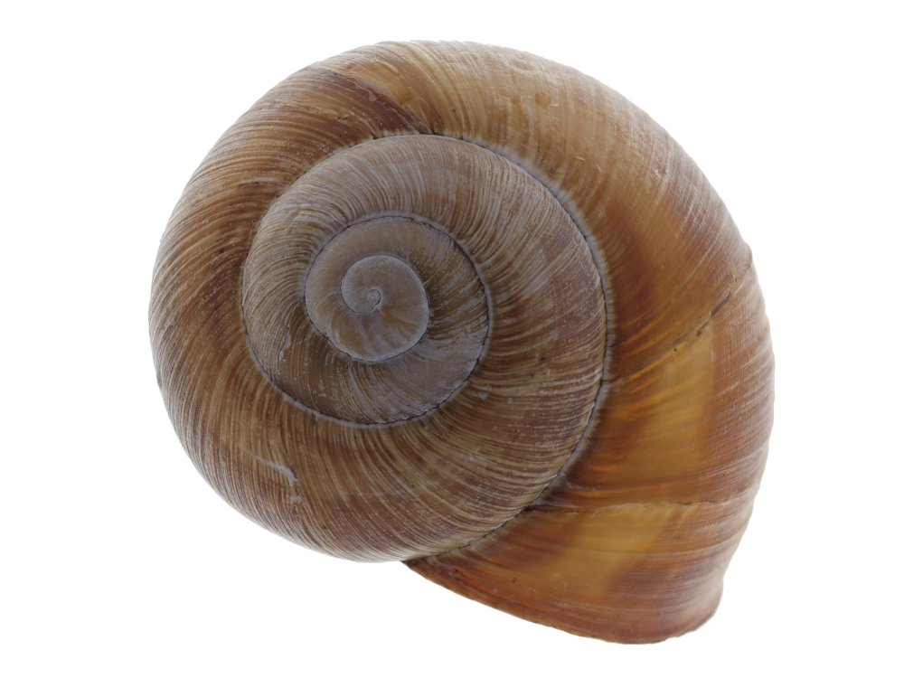
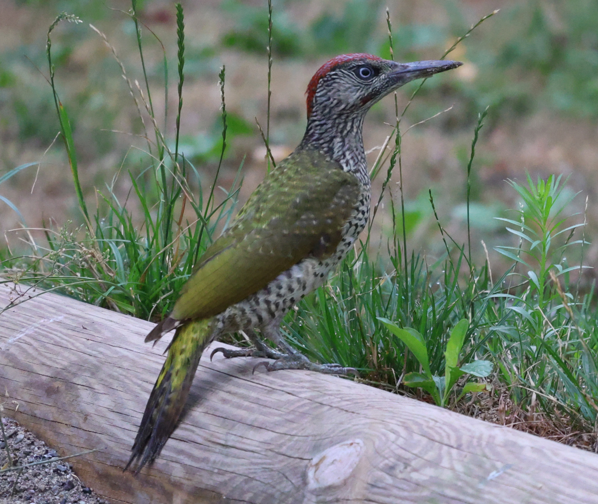

## subimg

A tool to hide another image in an image.

## Description

Writes pixels to a transparent area of an image from another image, leaving the alpha channel transparent. Supports PNG and TIFF types. The be hidded type can be PNG, TIFF, JPEG, GIF.

### Build

Build with Rust package manager.

```console
cargo b -r
```

### Usage:

#### Hides the image within the image.

```console
subimg inputImage.png --input=subImage.jpeg --output=outputImage.png
```

#### Saving an invisible image.

```console
subimg imageInImage.png --output-subimage=outputSubImage.jpeg
```

### Example:

#### Input image type PNG with transparent region and JPEG image file.
|| <br> </br>|
|:-:|:-:|

#### Makes the additional input image invisible.
```console
subimg gastropoda.png -i picus.jpeg -o gastropoda_picus.png
```
||
|:-:|

#### Extracts invisible image.
```console
subimg gastropoda_picus.png -O picus.jpeg
```
||<br> </br>|
|:-:|:-:|

## License

GNU General Public License v3.0
